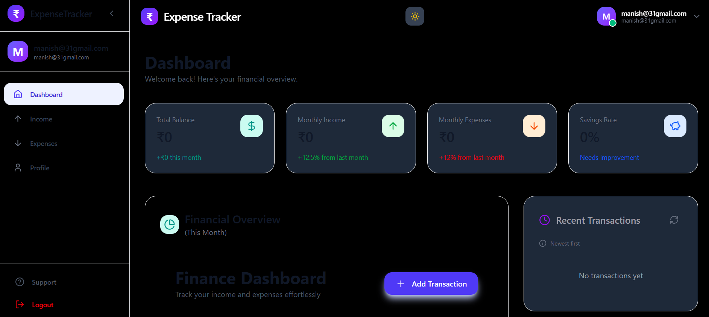
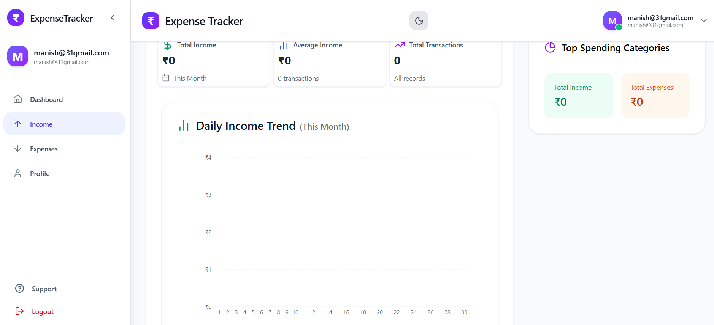
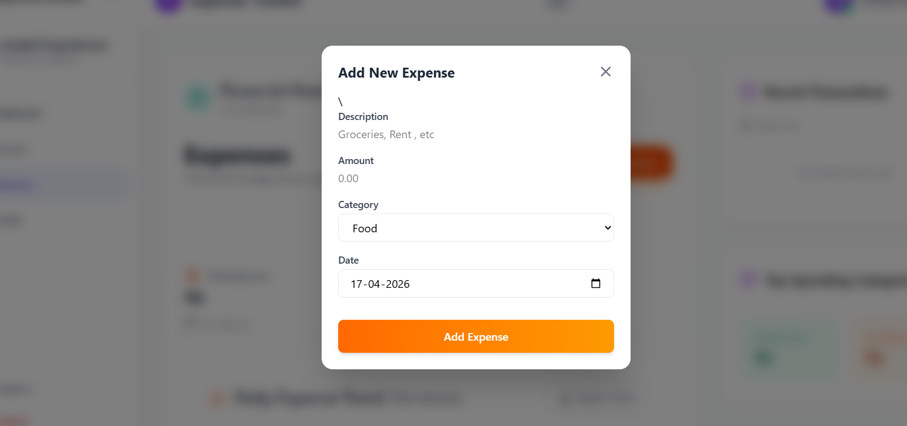
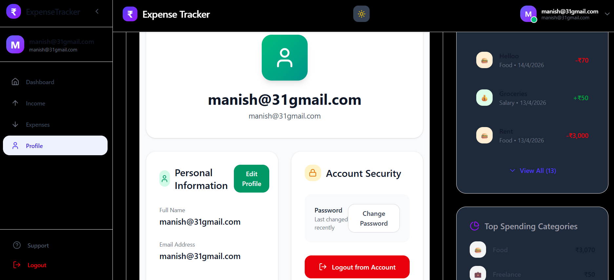

# 💰 Expense Manager

A full-stack web application to track, manage, and visualize your personal or business expenses efficiently.

Built with the **MERN Stack** (MongoDB, Express.js, React.js, Node.js).

---

## ✨ Features

- ✅ User Authentication (Register & Login with JWT)
- ✅ Add, Edit, and Delete Expenses
- ✅ Categorize expenses (Food, Transport, Rent, Shopping, etc.)
- ✅ Filter expenses by date, category, or amount
- ✅ Dashboard with expense summary and statistics
- ✅ Visual Charts (Pie Chart & Bar Chart) for spending analysis
- ✅ Monthly/Yearly expense reports
- ✅ Responsive Design (Mobile + Desktop friendly)
- ✅ Dark/Light Mode Support (Optional)
- ✅ Secure API with proper validation

---

## 🛠️ Tech Stack

### Frontend
- **React.js** (with Hooks & Context API / Redux)
- **React Router** for navigation
- **Chart.js** or **Recharts** for data visualization
- **Tailwind CSS** / **Material-UI** / **Bootstrap** (choose one)
- **Axios** for API calls

### Backend
- **Node.js** + **Express.js**
- **MongoDB** (with Mongoose ODM)
- **JWT (JSON Web Tokens)** for authentication
- **bcrypt.js** for password hashing
- **Express Validator** / **Joi** for input validation
- **dotenv** for environment variables

---


## 📂 Project Structure

```bash
expense-manager/
├── backend/
│   ├── config/
│   ├── controllers/
│   ├── middleware/
│   ├── models/
│   ├── routes/
│   ├── .env
│   └── server.js
│
├── frontend/
│   ├── public/
│   ├── src/
│   │   ├── components/
│   │   ├── pages/
│   │   ├── context/ or redux/
│   │   ├── utils/
│   │   ├── App.js
│   │   └── index.js
│   └── package.json
│
├── README.md
└── .gitignore

🚀 Getting Started
Prerequisites

Node.js (v18 or higher)
MongoDB (Local or MongoDB Atlas)
Git

Installation

Clone the repositoryBashgit clone https://github.com/yourusername/expense-manager.git
cd expense-manager
Backend SetupBashcd backend
npm installCreate a .env file in the backend folder:envPORT=4000
MONGO_URI=your_mongodb_connection_string
JWT_SECRET=your_jwt_secret_keyStart the backend server:Bashnpm run dev    # or   node server.js
Frontend SetupBashcd ../frontend
npm installStart the frontend:Bashnpm start
Open your browser and go to http://localhost:4000


## 📸 Screenshot


;





